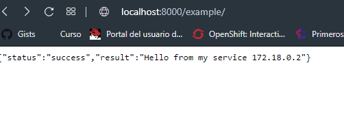

[](https://ko-fi.com/josephefranco)

# Un poco de Kong (Api Gateway)

La idea de este repositorio es una induccion muy rapida a la plataforma, la idea es no cubrir un curso ni la capacitacion adecuada sino entender que existe esta plataforma, algunos beneficios y despertar el interes para profundizar en la misma. 

## Comenzando 🚀

### Contexto
 

Kong es una aplicación programada en Lua que se ejecuta en Nginx aprovechando el módulo lua-nginx. Esta base permite que Kong sea extensible a través de una arquitectura de scripts Lua (denominados "complementos") que se pueden cargar en ‘caliente’, mientras está en ejecución.

En Mashape LLC, antiguo nombre de la compañía, en la actualidad Kong Inc, se construyó Kong originalmente para asegurar, administrar y extender más de 15.000 API y microservicios para su API Marketplace, con más de miles de millones de solicitudes por mes para más de 200.000 desarrolladores. Hoy en día, Kong se utiliza en implementaciones muy críticas en organizaciones tanto grandes como pequeñas. Durante los últimos años se ha ganado el éxito, dando servicios a empresas como Skyscanner, Harvard University, HealthCare.gov, Yahoo!, The New York Times, Nokia, Intel, GIPHY o Ferrari.


Algunas caracteristicas interesantes:
- Construido sobre NGINX
- En su mayor parte escrito en LUA
- Ampliable a través de muchos complementos / addins
- Admite dos tipos de base de datos, que también se pueden usar simultáneamente (Postgres, cassandra)
- Agnostico a la plataforma (disponible para debian / Ubuntu, RedHat / Centos, Docker, AWS, Google Cloud y muchos más).


Kong te permite conectar todos tus microservicios y API’s de forma escalable y flexible. Acelerando tus servicios al disminuir la latencia de tus desarrollos. Kong se encarga de facilitarte todo lo necesario para satisfacer la demanda de tus necesidades y gestión de API Gateway.

Kong se adapta a todo tipo de arquitecturas, desde aplicaciones monolíticas, microservicios, mesh o serverless.


## Levantando el ambiente de prueba

Creamos una red interna para los containers que vamos a utilizar
```
docker network create kong-net
```

Creamos el container de Cassandra 
```
docker run -d --name kong-cassandra-database --network=kong-net -p 9042:9042 cassandra:3
```

Creamos el container de Postgres
```
docker run -d --name kong-postgres-database --network=kong-net -p 5432:5432 -e "POSTGRES_USER=kong" -e "POSTGRES_DB=kong"  postgres:9.6
```

Corremos el kong migrations para generar lo necesario para correr nuestro servicio
```
docker run --rm --network=kong-net -e "KONG_DATABASE=postgres" -e "KONG_PG_HOST=kong-postgres-database" -e "KONG_CASSANDRA_CONTACT_POINTS=kong-postgres-database" kong:latest kong migrations bootstrap 
```  

Creamos el container de Kong con la vinculacion a los containers que creamos con anterioridad
```
docker run -d --name kong --network=kong-net -e "KONG_DATABASE=postgres" -e "KONG_PG_HOST=kong-postgres-database" -e "KONG_CASSANDRA_CONTACT_POINTS=kong-cassandra-database" -e "KONG_PROXY_ACCESS_LOG=/dev/stdout" -e "KONG_ADMIN_ACCESS_LOG=/dev/stdout" -e "KONG_PROXY_ERROR_LOG=/dev/stderr" -e "KONG_ADMIN_ERROR_LOG=/dev/stderr" -e "KONG_ADMIN_LISTEN=0.0.0.0:8001, 0.0.0.0:8444 ssl" -p 8000:8000 -p 8443:8443 -p 8001:8001 -p 8444:8444 kong:latest
```

El uso y la descripción del puerto son los siguientes:
- 8000: puerto proxy no habilitado para SSL para solicitudes de API
- 8443: puerto proxy habilitado para SSL para solicitudes de API
- 8001: API de administración RESTful para la configuración. Este es el puerto que se utilizará para interactuar y configurar Kong
- 7946 - Puerto utilizado para la agrupación de Kong

Todo el Script se encuentra en
```
run_kong.cmd
```

https://docs.konghq.com/install/docker/

## Construccion del primer servicio y ruta

Primero se deberá agregar un Servicio; ese es el nombre que Kong usa para referirse a las API y microservicios ascendentes que administra.

A los fines de prueba  crearemos un Servicio que apunte a la API de Mockbin. 

Antes de que pueda comenzar a realizar solicitudes contra el Servicio, deberá agregarle una Ruta. Las rutas especifican cómo (y si) las solicitudes se envían a sus Servicios una vez que llegan a Kong. Un solo servicio puede tener muchas rutas.

Después de configurar el Servicio y la Ruta, podrá realizar solicitudes a través de Kong usándolos.

Kong expone una API de administración RESTful en el puerto: 8001. La configuración de Kong, incluida la adición de servicios y rutas, se realiza a través de solicitudes en esa API.

Creamos nuevo servicio example-service con el endpoint que vamos a tener http://mockbin.org
```  
curl -i -X POST \
   --url http://localhost:8001/services/ \
   --data 'name=example-service' \
   --data 'url=http://mockbin.org'
```
```
{"host":"mockbin.org","created_at":1581606941,"connect_timeout":60000,"id":"a26912b7-b488-4e75-b94c-328e7d36abc6","protocol":"http","name":"example-service","read_timeout":60000,"port":80,"path":null,"updated_at":1581606941,"retries":5,"write_timeout":60000,"tags":null,"client_certificate":null}
```

Creamos la ruta del servicio example-service con el host que vamos a escuchar
```
curl -i -X POST \
   --url http://localhost:8001/services/example-service/routes \
   --data 'hosts[]=example.com'
```

```
{"id":"bbac5b29-396d-4101-8678-f16404105794","path_handling":"v0","paths":null,"destinations":null,"headers":null,"protocols":["http","https"],"methods":null,"snis":null,"service":{"id":"a26912b7-b488-4e75-b94c-328e7d36abc6"},"name":null,"strip_path":true,"preserve_host":false,"regex_priority":0,"updated_at":1581607009,"sources":null,"hosts":["example.com"],"https_redirect_status_code":426,"tags":null,"created_at":1581607009}
```

Verificamos el funcionamiento 
```
$ curl -i -X GET   --url http://localhost:8000/   --header 'Host: example.com'
```

Con esto tenemos seguridad de que ya esta atendiendo nuestra solicitud.


## Utilizar complementos

Una de las ventajas mas copadas de Kong, es que podemos utilizar complementos en caliente.
Vamos a seguir la guia oficial que utiliza el plugin de key-auth, el cual espera que uno le especifique el apikey para solicitar el servicio, en caso que no enviarsela o ser la correcta vamoso a tener un error 401.  Con esto sacamos responsabilidad a los microservicios que podemos tener construido en nuestra arquitectura y Kong se encargara de admininistrar este aspecto.
 
```
curl -i -X POST \
   --url http://localhost:8001/services/example-service/plugins/ \
   --data 'name=key-auth'
```

```
{"created_at":1581608309,"config":{"key_names":["apikey"],"run_on_preflight":true,"anonymous":null,"hide_credentials":false,"key_in_body":false},"id":"2d898b1a-02f4-4268-a838-d7d93f2ebe17","service":{"id":"a26912b7-b488-4e75-b94c-328e7d36abc6"},"enabled":true,"protocols":["grpc","grpcs","http","https"],"name":"key-auth","consumer":null,"route":null,"tags":null}
```

Nota: Este complemento también acepta un parámetro config.key_names, que por defecto es ['apikey']. Es una lista de encabezados y nombres de parámetros (ambos son compatibles) que se supone que contienen la apikey durante una solicitud.


```
curl -i -X GET \
>   --url http://localhost:8000/ \
>   --header 'Host: example.com'
```

```
{"message":"No API key found in request"}
```

Como no especificó el encabezado o parámetro de apikey requerido, la respuesta debe ser 401 No autorizado.

## Consumer/Clientes de nuestros servicios

Los consumidores están asociados a personas que usan su Servicio, y se pueden usar para el seguimiento, la administración de acceso y más.

Nota: Esta sección asume que ha habilitado el complemento key-auth. Si no lo ha hecho, puede habilitar el complemento u omitir los pasos dos y tres

Creamos el cliente
```
curl -i -X POST \
   --url http://localhost:8001/consumers/ \
   --data "username=Jose"
```

```
{"custom_id":null,"created_at":1581609082,"id":"40f470b8-bd1d-466d-a32d-60c62b5bb5d8","tags":null,"username":"Jose"}
```

En mi caso particular creo el api por sistema
```
$ od -x /dev/urandom | head -1 | awk '{OFS="-"; print $2$3,$4,$5,$6,$7$8$9}'
0b0939da-2069-bfa9-48c2-336ca67256dd
```

Y le asocio este valor al usuario
```
curl -i -X POST \
   --url http://localhost:8001/consumers/Jose/key-auth/ \
   --data 'key=0b0939da-2069-bfa9-48c2-336ca67256dd'
```

```
{"created_at":1581609321,"consumer":{"id":"40f470b8-bd1d-466d-a32d-60c62b5bb5d8"},"id":"f1975bf1-060b-42a5-a9dc-e8708fe13567","tags":null,"ttl":null,"key":"0b0939da-2069-bfa9-48c2-336ca67256dd"}
```

Ahora verificamos el acceso a la api
```
$ curl -i -X GET   --url http://localhost:8000   --header "Host: example.com"   --header "apikey: 0b0939da-2069-bfa9-48c2-336ca67256dd"
```


## Administracion de Kong mediante Konga
Sera que siempre destras de un gran hombre existe una gran mujer? Bueno tenemos Konga, la idea de es todas estas operaciones que hicimos mediante curl, utilizar una herramienta amigable para proceder a administrar esta herramienta.

Para eso levantamos un Container referenciando la imagen de konga en pantsel/konga
```
docker run -d -p 1337:1337 --network kong-net -e "TOKEN_SECRET={{somerandomstring}}"  --name konga  pantsel/konga
```
En este ejemplo, no especificamos nada ya que lo levantamos con los valores por defecto, salvo con la network ya que necesitamos visibilidad a nustro Kong.

Como toda herramienta nos va a solicitar crear un usuario administrador y posterior cargamos nuestra connection.


Vamos a tener que cargar nuestro Url de Admin de Kong, anteriormente redireccionamos este puerto a nuestro localhost ahora deberiamos cargar la Ip de nuestro contenedor que corre Kong para poder acceder a todas las funcionalidades,
 

 

 Si no sabemos como sacar la ip, deberian obtener el id del contenedor que corre Kong

```
docker container ls
CONTAINER ID        IMAGE                COMMAND                  CREATED             STATUS              PORTS                                                                NAMES
23e94e667712        nginx-test-service   "/usr/bin/openresty …"   18 hours ago        Up 24 minutes       0.0.0.0:1091->80/tcp                                                 srv_02
b018b55ca3a2        nginx-test-service   "/usr/bin/openresty …"   18 hours ago        Up 24 minutes       0.0.0.0:1090->80/tcp                                                 srv_01
3251d485527b        pantsel/konga        "/app/start.sh"          19 hours ago        Up 39 minutes       0.0.0.0:1337->1337/tcp                                               konga2
2ade2509ac0b        kong:latest          "/docker-entrypoint.…"   19 hours ago        Up 49 minutes       0.0.0.0:8000-8002->8000-8002/tcp, 0.0.0.0:8443-8444->8443-8444/tcp   kong
8f6ef75ec850        postgres:9.6         "docker-entrypoint.s…"   27 hours ago        Up 9 hours          0.0.0.0:5432->5432/tcp                                               kong-postgres-database
1a6c4affb8b5        cassandra:3          "docker-entrypoint.s…"   27 hours ago        Up 9 hours          7000-7001/tcp, 7199/tcp, 9160/tcp, 0.0.0.0:9042->9042/tcp            kong-cassandra-database
```
En el listado anterior seria el 2ade2509ac0b, entonces inspeccionamos el container
```
docker inspect  2ade2509ac0b
```
Dentro de la estructura encontramos que su ip local es
```
"IPAddress": "172.18.0.4",
```

Con ese valor ya podemos cargarlo en el Admin y habilitarlo.


## Implementar Load Balancing

Para poner un poco de contexto, tengo una api alojada en tres contenedores. Estas con srv_01, srv_02, srv_03, quiero desde Kong redireccionar todas las peticiones /example a estas api, en una carga del 33% a cada una. Con lo cual nos quedaria un esquema de la siguiente manera:


Dentro de la carpeta de test-service tenemos un servicio de prueba, construimos la imagen
```
docker build . -t nginx-test-service
```

Creamos dos servicios en paralelo para probar el balanceo de carga
```
docker run -d --privileged --name srv_01 -p 1090:80 --network=kong-net -ti nginx-test-service
docker run -d --privileged --name srv_02 -p 1091:80 --network=kong-net -ti nginx-test-service
docker run -d --privileged --name srv_03 -p 1092:80 --network=kong-net -ti nginx-test-service
```

Sino tambien pueden usar mi imagen de DockerHub
```
docker run -d --privileged --name srv_01 -p 1090:80 --memory="200m" -ti jsfrnc/nginx-test-service:latest
docker run -d --privileged --name srv_02 -p 1091:80 --memory="200m" -ti jsfrnc/nginx-test-service:latest
docker run -d --privileged --name srv_02 -p 1092:80 --memory="200m" -ti jsfrnc/nginx-test-service:latest
```
Ya tenemos todo levantado, si hacemos una peticion a uno de estos puertos vamos a ver que nos devuelve un mensaje hardcode pero con la ip del servidor, para saber cual nos va a estar respondiendo cuando hagamos el load balancer.

Para implementar este aspecto debemos generar un upstreams, es importante el nombre ya que vamos a tener que referenciarlo en nuestra url en los proximos pasos.

```
curl -i -X POST \
  --url http://localhost:8001/upstreams/ \
  --data 'name=semperti.v2.service' \
  --data 'slots=1000'
```
A este upstreams asociamos todos los targets que va a apuntar nuestro servicio, para generar nuestra distribucion de carga. En el atributo de weight enviamos como vamos a realizar la distribucion de las solicitudes.
```
curl -i -X POST \
  --url http://127.0.0.1:8001/upstreams/semperti.v2.service/targets \
  --data 'target=172.18.0.2:80' \
  --data 'weight=333'
curl -i -X POST \
  --url http://127.0.0.1:8001/upstreams/semperti.v2.service/targets \
  --data 'target=172.18.0.6:80' \
  --data 'weight=333'
curl -i -X POST \
  --url http://127.0.0.1:8001/upstreams/semperti.v2.service/targets \
  --data 'target=172.18.0.7:80' \
  --data 'weight=334'
```

Creamos nuestro servicio con la vinculacion a nuestro upstreams
```
curl -i -X POST \
   --url http://localhost:8001/services/ \
   --data 'name=semperti-service2' \
   --data 'url=http://semperti.v2.service'
```

Generamos una ruta, en este caso solo lo hice con un path /example
```
curl -i -X POST \
   --url http://localhost:8001/services/semperti-service2/routes \
   --data 'paths[]=/example'
```
Y probamos: 
 


## Roadmap
En estos puntos estoy trabajando

 - Algun complemento adicional, como log a algun consumers especifico 
 - Estrategias de Despliegue en caso de servicios ya productivos
 - Se escucha alguna idea

## Contribuyendo 🖇️

Por favor lee el [CONTRIBUTING.md]([CONTRIBUTING.md) para detalles del código de conducta, y el proceso para enviarnos pull requests.


## Licencia 📄

Mira el archivo [LICENSE.md](LICENSE.md) para detalles

## Expresiones de Gratitud 🎁

* Comenta a otros sobre este proyecto 📢
* Invita una cerveza 🍺 o un café ☕ a alguien del equipo. 
* Da las gracias públicamente 🤓.

---
⌨️ con ❤️ por [jose-franco](https://github.com/jose-franco) 😊
Si me queres contactar te dejo mi [Telegram](https://t.me/josfranco) y [Linkedin](https://www.linkedin.com/in/joffranco/).